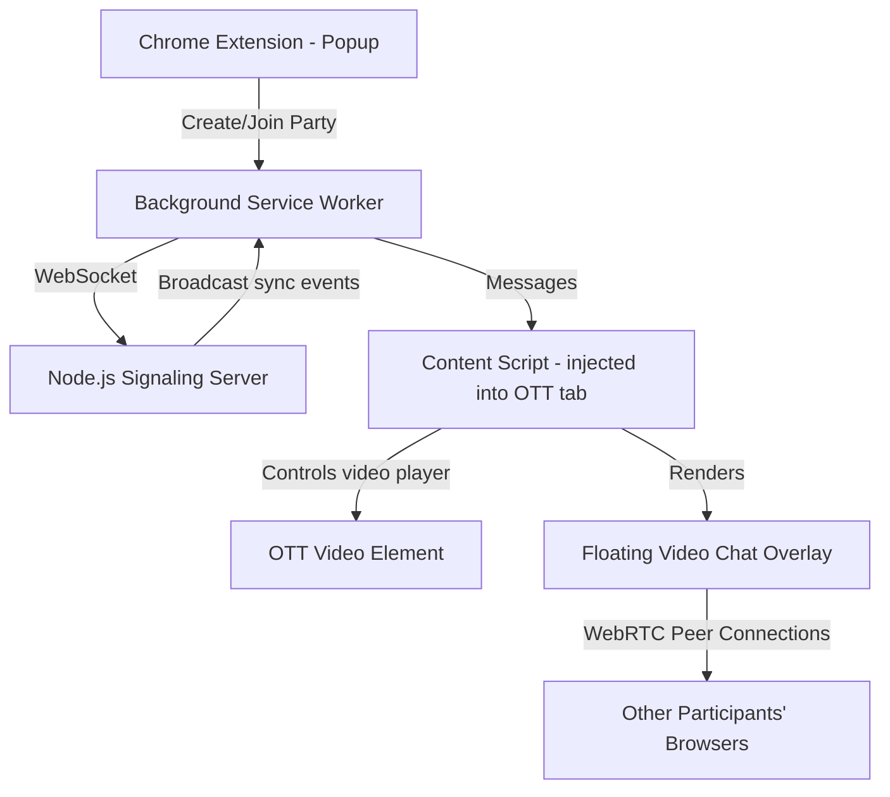

# WatchParty — Chrome Extension for Synchronized OTT Watching + Video Chat

A Chrome extension that lets users **host/join a watch party** on any OTT platform (Netflix, YouTube, Disney+, Prime Video, etc.) with **synchronized playback** and a **built-in video chat** so everyone can see each other while watching the same movie.

## How It Works (Architecture)



### Key Components
| Component | Technology | Purpose |
|---|---|---|
| **Popup** | HTML/CSS/JS | Create or join a room, show party link |
| **Background** (Service Worker) | JS + WebSocket | Manages connection to signaling server, relays messages |
| **Content Script** | JS | Injects into OTT page, hooks into `<video>` element, syncs play/pause/seek, renders video chat overlay |
| **Signaling Server** | Node.js + `ws` | Room management, relays sync & WebRTC signaling messages between peers |
| **Video Chat** | WebRTC + free STUN servers | Peer-to-peer video/audio between participants |

---

## Proposed Changes

### 1. Chrome Extension Scaffold

#### [NEW] [manifest.json](file:///Users/angad/Documents/GitHub/WatchParty/manifest.json)
- Manifest V3 Chrome extension config
- Permissions: `activeTab`, `storage`, `tabs`
- Content script matches: `*://*.netflix.com/*`, `*://*.youtube.com/*`, `*://*.hotstar.com/*`, `*://*.primevideo.com/*`, `*://*.jiocinema.com/*`, `*://*.zee5.com/*` (and a general `*://*/*` fallback)
- Background service worker, popup, and content script entry points

#### [NEW] [icons/](file:///Users/angad/Documents/GitHub/WatchParty/icons/)
- Extension icons at 16, 48, 128px (generated via AI)

---

### 2. Popup UI — Create / Join Party

#### [NEW] [popup/popup.html](file:///Users/angad/Documents/GitHub/WatchParty/popup/popup.html)
#### [NEW] [popup/popup.css](file:///Users/angad/Documents/GitHub/WatchParty/popup/popup.css)
#### [NEW] [popup/popup.js](file:///Users/angad/Documents/GitHub/WatchParty/popup/popup.js)

- Premium glassmorphic dark UI with vibrant accent colors
- **Create Party** button → generates a unique room code, copies a shareable link
- **Join Party** input → paste room code to join an existing session
- Shows connected participants once in a room
- Shows party status (synced / waiting)

---

### 3. Background Service Worker

#### [NEW] [background/service-worker.js](file:///Users/angad/Documents/GitHub/WatchParty/background/service-worker.js)

- Opens/maintains a WebSocket connection to the signaling server
- Relays messages between popup ↔ content script ↔ server
- Handles room lifecycle: create room, join room, leave room
- Broadcasts playback sync events (play, pause, seek, playback rate) to server

---

### 4. Content Script — Video Sync + Chat Overlay

#### [NEW] [content/content.js](file:///Users/angad/Documents/GitHub/WatchParty/content/content.js)
#### [NEW] [content/content.css](file:///Users/angad/Documents/GitHub/WatchParty/content/content.css)
#### [NEW] [content/overlay.js](file:///Users/angad/Documents/GitHub/WatchParty/content/overlay.js)

**Video Sync Logic (`content.js`):**
- Detects the main `<video>` element on the page (with retry/MutationObserver for SPAs)
- Hooks `play`, `pause`, `seeked`, `ratechange` events
- On local action → sends sync event to background → server → other peers
- On incoming sync event → applies action to local `<video>` without re-triggering outbound sync
- Handles edge cases: buffering, latency compensation, preventing event loops

**Video Chat Overlay (`overlay.js`):**
- Injects a **floating draggable panel** in the bottom-right corner of the OTT page
- Shows webcam feeds of all participants (WebRTC peer connections)
- Uses free Google STUN servers (`stun:stun.l.google.com:19302`)
- Signaling for WebRTC is routed through the same WebSocket server
- Controls: toggle camera, toggle mic, leave party
- Minimizable/collapsible so it doesn't block the movie

**Overlay Styling (`content.css`):**
- Dark semi-transparent panel with rounded corners and subtle glow
- Participant video tiles in a grid or horizontal strip
- Smooth animations for join/leave

---

### 5. Signaling Server (Node.js)

#### [NEW] [server/server.js](file:///Users/angad/Documents/GitHub/WatchParty/server/server.js)
#### [NEW] [server/package.json](file:///Users/angad/Documents/GitHub/WatchParty/server/package.json)

- Lightweight WebSocket server using the `ws` library
- **Room management**: create room (generates 6-char code), join room, leave room
- **Sync relay**: when a user plays/pauses/seeks, broadcast to all others in the room
- **WebRTC signaling relay**: forward SDP offers/answers/ICE candidates between peers
- **Participant tracking**: track who's in each room, broadcast join/leave events
- Runs on `localhost:3000` for development (can be deployed to any cloud later)

---

### 6. Shared Utilities

#### [NEW] [shared/constants.js](file:///Users/angad/Documents/GitHub/WatchParty/shared/constants.js)
- Message type constants (`SYNC_PLAY`, `SYNC_PAUSE`, `SYNC_SEEK`, `RTC_OFFER`, `RTC_ANSWER`, `ICE_CANDIDATE`, etc.)
- Server URL config
- Room code generation utility

---

## User Review Required

> [!IMPORTANT]
> **Signaling Server**: The extension needs a small WebSocket server to coordinate rooms, sync events, and WebRTC signaling. For now I'll build it as a local Node.js server (`localhost:3000`). You can later deploy it to a cloud service (Render, Railway, Fly.io, etc.) for production use.

> [!IMPORTANT]
> **OTT Compatibility**: This extension injects into pages and hooks into the native `<video>` HTML element. It works on platforms that use standard `<video>` tags (YouTube, Netflix, Prime Video, Hotstar, etc.). Some platforms with heavy DRM or custom players may need additional handling later.

> [!NOTE]
> **No Google Meet integration required**: Instead of opening a separate Meet link, the extension has its own **built-in video chat** using WebRTC directly in the page. This is a much better UX — participants see each other in a small overlay while watching the movie, with no need to switch tabs.

---

## Verification Plan

### Manual Verification (in Chrome Browser)

1. **Load the Extension**
   - Open `chrome://extensions`, enable Developer Mode
   - Click "Load unpacked" and select the `/Users/angad/Documents/GitHub/WatchParty` directory
   - Verify the extension icon appears in the toolbar

2. **Start the Signaling Server**
   ```bash
   cd /Users/angad/Documents/GitHub/WatchParty/server && npm install && node server.js
   ```
   - Verify it logs "Server listening on port 3000"

3. **Create a Watch Party**
   - Click the extension icon → click "Create Party"
   - Verify a room code is generated and displayed
   - Open a YouTube video → verify the overlay panel appears

4. **Join from a Second Window**
   - Open another Chrome window (or incognito)
   - Load the extension there too
   - Click extension icon → paste the room code → click "Join Party"
   - Verify both windows show as connected

5. **Test Video Sync**
   - In Window 1, play the video → verify it auto-plays in Window 2
   - Pause in Window 2 → verify it pauses in Window 1
   - Seek to a different timestamp → verify the other window jumps to the same time

6. **Test Video Chat**
   - Grant camera/mic permissions in both windows
   - Verify webcam feeds appear in the overlay panel on both sides

> [!NOTE]
> Since this is a Chrome extension with WebSocket + WebRTC, automated unit testing is limited. The primary verification is **manual browser testing** as described above. I'll use the browser subagent to visually verify the extension loads and the UI renders correctly.
